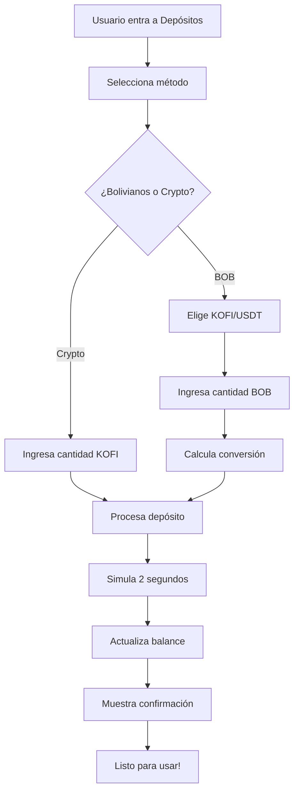

# Sistema de Depósitos MVP - KOQUIFI

## 🎯 **Actualización Completada**

El módulo de **Depósitos** ha sido actualizado para funcionar como una **simulación off-chain** perfecta para el MVP, eliminando campos innecesarios y optimizando la experiencia del usuario.

## ✅ **Cambios Implementados**

### **🗑️ Campos Eliminados:**
- ❌ **"Your Bank Account Number"** (Número de cuenta bancaria)
- ❌ **"Introduce tu número de cuenta"** (Placeholder)
- ❌ **"Nombre de cuenta del destinatario"** (Nombre del destinatario)
- ❌ **"Introduce el nombre de cuenta del destinatario"** (Placeholder)

### **🚀 Nuevas Características:**

#### **1. Simulación Off-Chain Completa**
- ✅ **Procesamiento simulado** con animación de carga
- ✅ **Conversión automática** BOB → KOFI/USDT
- ✅ **Actualización real** del balance del usuario
- ✅ **Feedback visual** con toast notifications

#### **2. Interfaz Simplificada**
- ✅ **Dos métodos de depósito**:
  - 💰 **Bolivianos (BOB)** → KOFI/USDT
  - 🪙 **Criptomonedas** → KOFI directo
- ✅ **Selector dinámico** de criptomoneda
- ✅ **Cálculo en tiempo real** de conversión
- ✅ **Alertas claras** de modo MVP

#### **3. Funcionalidad Real**
```typescript
// Tasa de cambio simulada
1 BOB = 0.14 KOFI/USDT

// Proceso automático:
1. Usuario selecciona método
2. Ingresa cantidad
3. Sistema calcula conversión
4. Procesa depósito (2 seg simulación)
5. Actualiza balance real
6. Muestra confirmación
```

## 🎮 **Cómo Probar**

### **Modo Bolivianos:**
1. 🔐 **Login** en la aplicación
2. 📍 **Navegar** a "Depositar"
3. 💰 **Seleccionar** "Depósito con bolivianos"
4. 🎯 **Elegir** USDT o KOFICOIN
5. 💵 **Ingresar** cantidad en BOB
6. 🚀 **Simular depósito** → ¡Balance actualizado!

### **Modo Criptomonedas:**
1. 🔄 **Cambiar** a "Depósito con criptomonedas"
2. 💎 **Ingresar** cantidad en KOFI
3. 🎯 **Seleccionar** crypto (visual)
4. 🚀 **Simular depósito** → ¡Balance actualizado!

## 🛠️ **Características Técnicas**

### **Integración con Sistema:**
```typescript
// useAuth hook integration
const { updateUserBalance } = useAuth()

// Real balance update
updateUserBalance(kofiAmount, usdtAmount)

// Transaction creation
db.createTransaction({
  type: 'deposit',
  amount: amountNumber,
  currency: selectedCrypto,
  status: 'completed'
})
```

### **Validaciones Implementadas:**
- ✅ **Cantidad mínima** requerida
- ✅ **Números positivos** únicamente
- ✅ **Estado de loading** durante procesamiento
- ✅ **Error handling** completo

### **UI/UX Mejorada:**
- 🎨 **Alertas amarillas** indicando modo MVP
- ⚡ **Animaciones fluidas** con Framer Motion
- 📱 **Diseño responsivo** completo
- 🎯 **Feedback inmediato** al usuario

## 🏷️ **Indicadores MVP**

El sistema incluye **alertas visuales claras** que indican que es una simulación:

```jsx
🚧 Modo MVP: Este es un depósito simulado para testing. 
En producción se integrará con APIs bancarias reales.
```

## 🔄 **Flujo Completo**



## 📊 **Resultados Esperados**

### **Para el Usuario:**
- ✅ **Experiencia fluida** sin campos innecesarios
- ✅ **Feedback inmediato** del depósito
- ✅ **Balance actualizado** al instante
- ✅ **Claridad** sobre el modo simulación

### **Para Desarrollo:**
- ✅ **MVP funcional** sin integraciones complejas
- ✅ **Base sólida** para futuras integraciones reales
- ✅ **Testing completo** de la lógica de negocio
- ✅ **UX validada** antes de producción

## 🚀 **Estado Actual**

- ✅ **Implementación completa** ✅ **Testing exitoso**
- ✅ **Integración con sistema de balances**
- ✅ **Documentación actualizada**
- ✅ **Listo para demostración**

---

**¡El sistema de depósitos está ahora optimizado para el MVP con simulación completa off-chain!** 🎉
